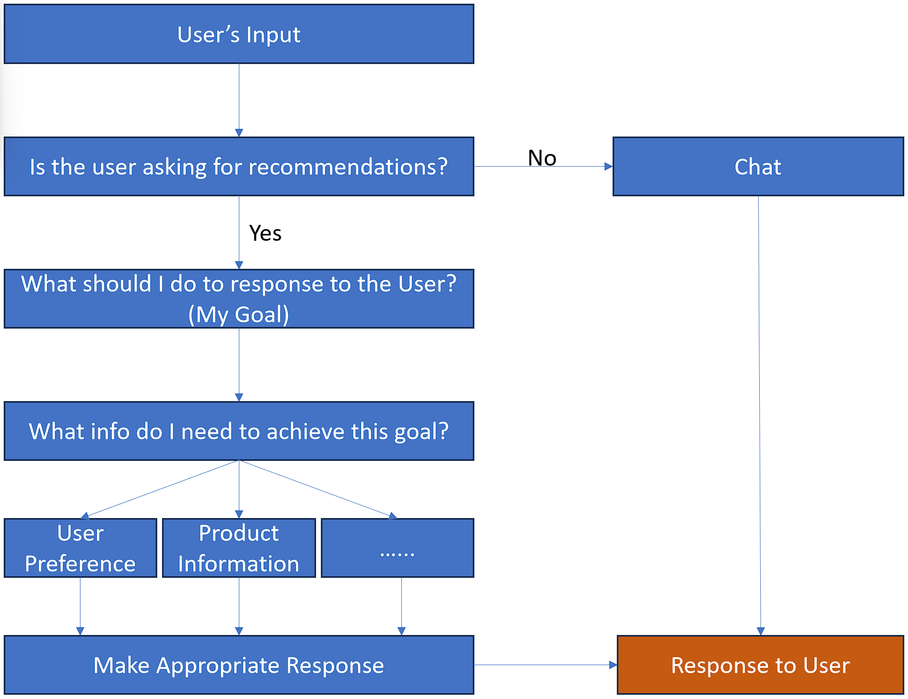
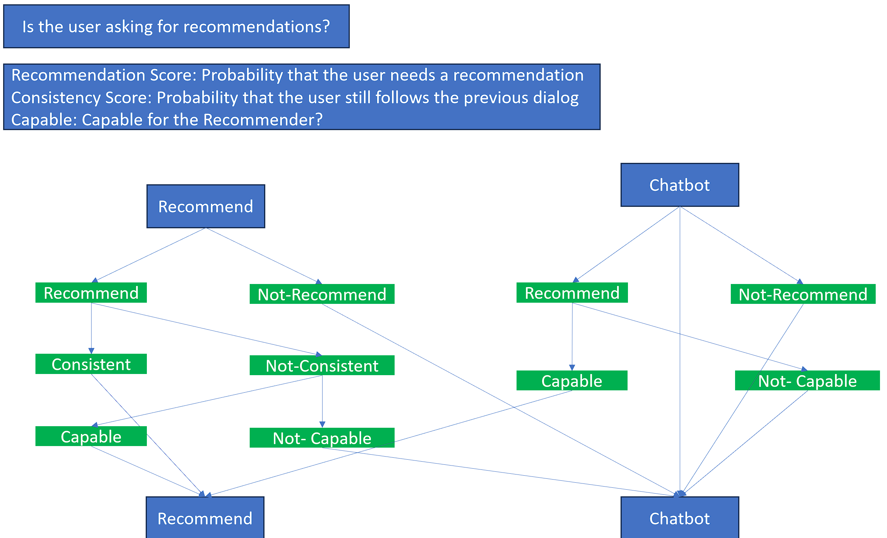
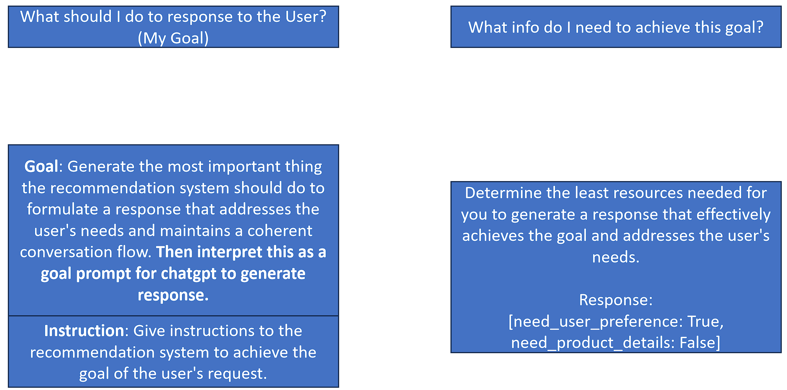
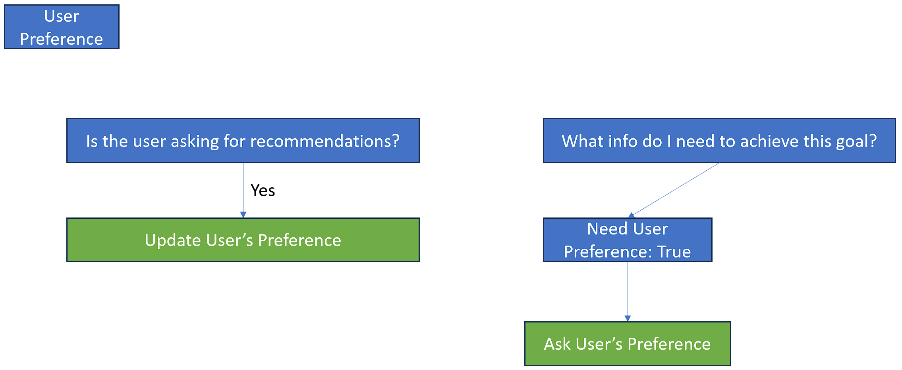
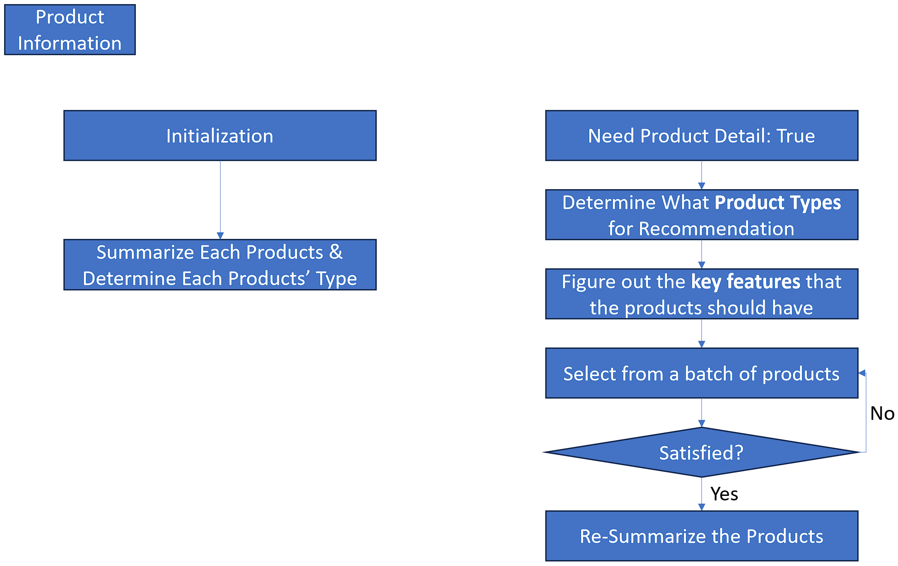

# Conversational Recommendation System

## What is a Conversational Recommendation System?

- Conversational
    - Personalized and **Contextually Relevant**


- Recommendation System
    - Based on **given product database**
    - Based on **the user’s preference**
    - Extra information/Common knowledge

## If we want to leverage ChatGPT...

- ChatGPT can cover:
    - Conversational
    - Retrieval & Summary of given information
    ```
    [[User]]: Can you tell me more about the book 'Harry Potter'?

    [[ChatGPT]]: "Harry Potter" is a series of fantasy novels written by British author J.K. Rowling. The series follows the life of its protagonist, Harry Potter, a young wizard who discovers his magical abilities on his eleventh birthday. The books chronicle Harry's journey as he attends Hogwarts School of Witchcraft and Wizardry and battles against the dark wizard Lord Voldemort.
    ```

- ChatGPT cannot cover:
    - Based on the user’s preference:
        ```
        [[User]]: Recommend a movie for me

        [[What We May Expect]]: Could you please tell me what genre of movies you prefer?

        [[ChatGPT]]: I would recommend the movie "Inception" directed by Christopher Nolan. It's a mind-bending science fiction film that explores the concept of dreams and subconsciousness. With its intricate plot, stunning visuals, and captivating performances by Leonardo DiCaprio, Joseph Gordon-Levitt, and Ellen Page, "Inception" is a thrilling and thought-provoking cinematic experience.
        ```
    - Based on the current product information:
        ```
        [[User]]: I want a horror movie released in 2022

        [[What We May Expect]]: I recommend you watch 'The Menu'. It is a horror movie released in 2022. The movie has a rating of 7.2 on IMDB and 71 Metascore. The plot revolves around a young couple who travels to a remote island to eat at an exclusive restaurant where the chef has prepared a lavish menu, with some shocking surprises. The movie is directed by Mark Mylod and stars Ralph Fiennes, Anya Taylor-Joy, Nicholas Hoult, and Hong Chau. Enjoy the movie!

        [[ChatGPT]]: Title: "Shadowed Fears"

        Plot: 
        "Shadowed Fears" is a supernatural horror movie set in a small, isolated town called Hollowbrook. The town is shrouded in darkness and plagued by a terrifying curse. A group of five old friends, who grew up in Hollowbrook, reunite after decades for a weekend retreat at a remote cabin located deep in the dense forest surrounding the town. Little do they know, they have unwittingly stepped into a nightmare realm.

        As the group arrives at the cabin, they soon start noticing strange occurrences around them – whispers in the dark, unexplained shadows lurking in the corners, and eerie apparitions. They soon realize that the curse that has haunted Hollowbrook for generations is now targeting
        ```
    - Reasoning in Recommendation:
        ```
        [[User]]: I want a harry-potter like cellphone

        [[What We May Expect]]: I found a cellphone that might interest you. The UMIDIGI G3 MAX has a 6.6-inch FHD display and a 50MP Ultra-Clear AI camera. It also has a massive 5150mAh battery and supports expandable storage up to 1TB. This cellphone has some 'magical' features that resemble the magical world of Harry Potter. It is priced at $139.99. Would you like more information about this cellphone?

        [[ChatGPT]]: While there isn't a specific "Harry Potter-like" cellphone available, you can still customize your existing cellphone to give it a Harry Potter-inspired look or feel. Here are a few suggestions:

        1. Phone Case: Search for Harry Potter-themed phone cases online or in specialty stores. There are various designs available featuring Hogwarts houses, the Marauder's Map, or the Golden Snitch.

        2. Harry Potter Wallpapers: Find Harry Potter wallpapers or images online and set them as your phone's background or lock screen. This will give your phone a magical touch whenever you use it.

        3. Harry Potter Apps: Look for Harry Potter-related apps that can be downloaded to your cellphone. These apps can include games, spellcasting simulations, or virtual Hogwarts
        ```
    


### ChatGPT does really well on maintaining a conversation, but it doesn't exactly know what a Recommendation System is. It should be treated as a tool in our Recommendation System. 

## Framework
- What should I do when I am recommending to a User?


- How can I use ChatGPT as a tool to do this?
    - 
    - 
    - 
    - 
    - Fault/Hallucination Detection: Evaluate whether the current conversational recommendation system response accurately and reasonably.

## How to evaluate the system?

- Evaluator: You are an expert evaluator in the conversational recommendation field, and your task is to test the functionality and rubostness of the system.
- Scorer: Please assess the conversation and provide a score from 1 to 10, evaluating the overall performance of the conversational recommendation system.

### Evaluate Cases

#### Common Cases

- Reflect user’s preference
- User update their preference
- User look into detail of a certain product
- Summarize the product from the user’s preference view
- Compare products from the user’s preference view
- Recommend products from the user’s preference view

#### Strong Cases

- Cases that user don’t express preference in an explicit way.
- Cases that user change their preference
- Cases that user change their need of product

#### Robust Cases

- The user’s request for the product doesn’t provided by resource and cannot be inferenced
- The user start to chat with the system
- The user rewind back to ask for another recommendation

#### Real Cases

- log from testing
- chat with fake user
